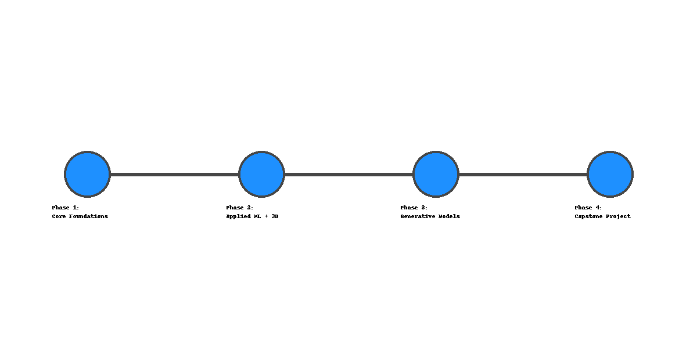

# 🧠 3D AI Model Generation – Personal Learning Roadmap

Welcome! This repository contains my **personal learning roadmap** for mastering the pipeline of generating **3D models from 2D images using AI techniques**.

My long-term goal is to build a tool that can transform concept art, sketches, or photos into **game-ready 3D assets**, including mesh generation, rigging, and texture mapping — deployable directly in engines like Unity, Unreal, or Godot.

---

## 🔥 Key Topics Covered:
- 🏗️ 3D Data Processing & Computer Vision
- 📊 Machine Learning & Deep Learning Foundations
- 🧠 3D Generative AI (NeRF, Gaussian Splatting, DreamFusion, Point-E, Shap-E)
- 🎮 Game Asset Automation (Meshes, Rigging, Export Pipelines)
- 🛠️ Practical Deployment (APIs, Tools, Game Engines)

---

## 🚩 Purpose
This repository serves as:
- 📚 A structured learning plan
- 🗺️ A personal knowledge map
- 🚀 A motivator for deep, focused learning
- 🎯 A portfolio in progress

> ⚠️ **Note:** This is a personal learning journey, not a finished product or course. Others are welcome to follow, fork, or adapt it to their own learning needs.

---

## 🚀 Roadmap Overview

_Phases:_

1. **Core Foundations**
2. **Applied ML + 3D Data**
3. **Advanced Generative Models**
4. **Capstone Project – MVP Product**

---

## 📅 Phase 1: Core Foundations (3-4 months)

**Goals:**
- Learn Python, ML basics, math for ML, and Blender basics.

**Resources:**
- Python: [Automate the Boring Stuff](https://automatetheboringstuff.com/)
- Python: [Python for Everybody (Coursera)](https://www.coursera.org/specializations/python)
- Math: [Essence of Linear Algebra (3Blue1Brown)](https://youtube.com/playlist?list=PLZHQObOWTQDMsr9K-rj53DwVRMYO3t5Yr)
- Math: [Khan Academy – Probability & Statistics](https://www.khanacademy.org/math/statistics-probability)
- ML: [Kaggle Intro to ML](https://www.kaggle.com/learn/intro-to-machine-learning)
- ML: [Google ML Crash Course](https://developers.google.com/machine-learning/crash-course)
- 3D: [Blender Beginner Tutorial](https://youtu.be/TPrnSACiTJ4)
- 3D: [Blender Python API Docs](https://docs.blender.org/api/current/info_quickstart.html)

**Tools:**
- Python (NumPy, pandas, matplotlib, scikit-learn)
- Blender + Blender API

**Mini Projects:**
- Image classifier
- Blender script for procedural object generation

---

## 📅 Phase 2: Applied ML + 3D Data (4-6 months)

**Goals:**
- Apply ML to images, learn about 3D data formats, processing, and vision tasks.

**Resources:**
- Deep Learning: [Andrew Ng’s Deep Learning Specialization](https://www.coursera.org/specializations/deep-learning)
- FastAI: [Practical Deep Learning](https://course.fast.ai/)
- OpenCV: [PyImageSearch OpenCV Course](https://www.pyimagesearch.com/opencv-computer-vision-course/)
- 3D Vision: [ETH Zurich 3D Vision Lectures](https://youtube.com/playlist?list=PLgnQpQtFTOGQy0Yv8N8D1-06c2G26Gosv)

**Tools & Libraries:**
- PyTorch, TensorFlow
- OpenCV, Detectron2, Segment Anything
- Open3D, trimesh, pymeshlab

**Mini Projects:**
- Depth-map to mesh converter
- OpenCV image segmentation
- Export simple 3D models to Unity/Unreal

---

## 📅 Phase 3: Advanced Generative Models (6-8 months)

**Goals:**
- Work with cutting-edge 3D generative AI models.

**Resources & Repos:**
- NeRF: [Instant-NGP](https://github.com/NVlabs/instant-ngp), [NerfStudio](https://docs.nerf.studio/)
- Gaussian Splatting: [Research Repo](https://repo-sam.inria.fr/fungraph/3d-gaussian-splatting/)
- DreamFusion: [Project Page](https://dreamfusion3d.github.io/)
- OpenAI: [Point-E](https://github.com/openai/point-e), [Shap-E](https://github.com/openai/shap-e)

**Mini Projects:**
- Generate models from few images using NeRF or Gaussian splatting
- Mesh clean-up and auto-rigging

---

## 📅 Phase 4: Capstone – MVP Product (3-6 months)

**Goal:** Build an app that converts images to game-ready 3D models.

**Tech Stack:**
- Backend: Python, PyTorch, NeRF, Gaussian Splatting
- 3D: Blender API for mesh cleaning, auto rigging
- Frontend: Web (Three.js) or Desktop (PyQt/Blender add-on)
- Game Engines: Unity, Unreal, or Godot

**Deployment:**
- Docker, CUDA/cuDNN
- CI/CD with GitHub Actions
- Host on Hugging Face Spaces, GitHub Pages, or Sketchfab

---

## 🔥 Bonus Resources

**Stay Updated:**
- [Papers with Code – 3D Reconstruction](https://paperswithcode.com/task/3d-reconstruction)
- [Arxiv Sanity Preserver](http://www.arxiv-sanity.com/)

**Community:**
- Blender Artists Forum
- r/MachineLearning
---

## 🏁 Final Note

This roadmap is designed to be flexible and personal. The focus is on learning deeply rather than rushing. Contributions welcome, but this serves as a personal guide for my journey.

---
